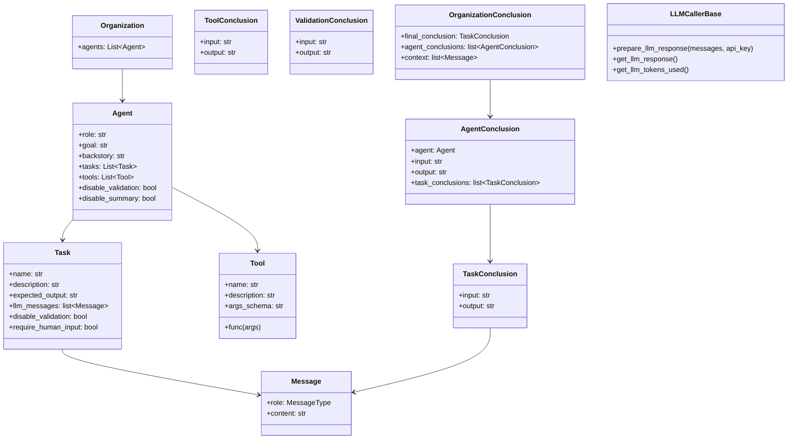
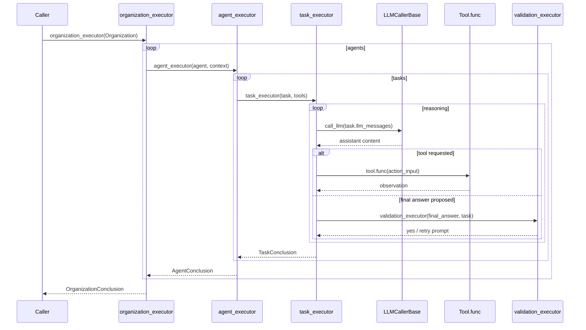

# gpt_agents.py

🚨 **Highlight: Native Anthropic Claude support ships in the box!**

[](https://pypi.org/project/gpt-agents-py/)

A minimal, hackable Python framework for orchestrating multi-agent LLM workflows with tools, validation, and human-in-the-loop controls—all implemented in a single core module: [`gpt_agents_py/gpt_agents.py`](https://github.com/jameswdelancey/gpt_agents.py/blob/main/gpt_agents_py/gpt_agents.py).

## At a Glance

- **Single-file core** – every control-flow primitive lives in one file for easy auditing and modification.
- **Multi-agent orchestration** – compose `Agent` objects into an `Organization` and stream conclusions between them.
- **Tool-first reasoning** – agents are prompted to rely on registered `Tool` callables for deterministic actions.
- **Automatic validation** – each task can be auto-validated and retried until success, with optional human input.
- **Pluggable LLM transport** – swap in any provider by subclassing `LLMCallerBase` (OpenAI by default, Anthropic extension included).

## Table of Contents

1. [Quick Start](#quick-start)
2. [Key Concepts](#key-concepts)
3. [Architecture](#architecture)
4. [Execution Flow](#execution-flow)
5. [Customising Behaviour](#customising-behaviour)
6. [Anthropic Claude Integration](#anthropic-claude-integration)
7. [Examples](#examples)
8. [Development](#development)
9. [Contributing](#contributing)
10. [License](#license)

## Quick Start

### Requirements

- Python **3.11 or newer**
- `api_key.json` alongside your script or at the project root containing at least one provider key:

  ```json
  {
    "openai": "sk-your-openai-key",
    "anthropic": "sk-ant-your-claude-key"
  }
  ```

  Either key is optional—include the providers you plan to use.

### Installation

You can install the published package or work directly from source (both paths share the same zero-runtime-dependency core).

```bash
pip install gpt-agents-py
# or
git clone https://github.com/jameswdelancey/gpt_agents.py
cd gpt_agents.py
```

### Minimal Usage

```python
from gpt_agents_py.gpt_agents import Agent, Organization, Task, Tool, organization_executor


def population_tool(args: dict[str, str]) -> str:
    data = {"france": "67000000", "germany": "83000000"}
    return data.get(args.get("country", "").lower(), "unknown")


agent = Agent(
    role="Researcher",
    goal="Retrieve France's population",
    backstory="Demographics expert",
    tasks=[
        Task(
            name="get_population",
            description="Look up France's population",
            expected_output="67000000",
            llm_messages=[],
        ),
    ],
    tools=[
        Tool(
            name="PopulationLookup",
            description="Returns known population figures",
            args_schema="country:str",
            func=population_tool,
        ),
    ],
)

org = Organization(agents=[agent])
print(organization_executor(org))
```

## Key Concepts

- **`Agent`** – wraps a role, goal, backstory, `Task` list, and tool inventory. Agents optionally skip validation or summaries via flags.
- **`Task`** – stores the work description, expected output, validation flags, and the full LLM message transcript that powers retries.
- **`Tool`** – a lightweight adapter around a Python callable. Tools declare a name, description, and argument schema and return stringified observations.
- **`Organization`** – an ordered collection of agents whose conclusions feed downstream peers.
- **`LLMCallerBase`** – transport abstraction that prepares HTTP requests, records responses, and exposes token counts. Override it to plug in any provider.
- **Prompts registry** – the `Prompts` named tuple houses every system/user template used during orchestration and can be adjusted at runtime via `set_prompt_value`.

## Architecture



## Execution Flow



## Customising Behaviour

### Swap in a Different LLM Provider

Implement a subclass of `LLMCallerBase`, then register it globally:

```python
from gpt_agents_py.gpt_agents import LLMCallerBase, Message, MessageType, set_llm_caller


class EchoCaller(LLMCallerBase):
    def prepare_llm_response(self, messages: list[Message], api_key: str = "openai") -> None:
        payload = "\n".join(f"{m.role.value}: {m.content}" for m in messages)
        self._response_text = payload[::-1]
        self._tokens_used = 0


set_llm_caller(EchoCaller())
```

### Enable Debug & Trace Modes

- `set_debug_mode(True)` pauses after every reasoning step until you press Enter.
- `set_trace_mode(True, "trace.txt")` captures every prompt/response pair to disk for auditing.

### Override Prompts at Runtime

Every template in `PROMPTS` can be swapped while preserving placeholder parity:

```python
from gpt_agents_py.gpt_agents import set_prompt_value

set_prompt_value("instruction_prompt", "You are a concise assistant. Answer in bullet points.")
```

### Human-in-the-loop Tasks

Set `require_human_input=True` on a task to pause execution and ask for manual guidance between retries.

## Anthropic Claude Integration

Use the provided extension to route requests to Anthropic's Claude API:

```python
from gpt_agents_py.extensions.anthropic_llm_caller import AnthropicLLMCaller
from gpt_agents_py.gpt_agents import set_llm_caller

set_llm_caller(AnthropicLLMCaller())
```

See [`examples/anthropic_basic_usage.py`](https://github.com/jameswdelancey/gpt_agents.py/blob/main/examples/anthropic_basic_usage.py) for a full walk-through, including trace logging.

## Examples

Run the sample scripts from the repository root:

```bash
python examples/basic_usage.py                     # Normal mode
python examples/basic_usage.py --debug             # Step-through reasoning
python examples/basic_usage.py --trace             # Persist prompts/responses
python examples/basic_usage.py --trace --trace-filename mylog.txt
python examples/basic_usage.py --debug --trace     # Combine both flags
python examples/anthropic_basic_usage.py           # Claude transport demo
```

Example outputs are logged with JSON helpers to keep audit trails readable.

## Development

Install dev dependencies via pip or Poetry and run the provided checks:

```bash
pip install black isort mypy flake8
# or
poetry install --with dev
```

### Testing & Quality Gates

```bash
python -m unittest discover tests
black --check gpt_agents_py examples tests
isort --check gpt_agents_py examples tests
flake8 gpt_agents_py examples tests
mypy gpt_agents_py examples tests
```

CI runs the same matrix across Python 3.11–3.12.

## Contributing

Issues and pull requests are welcome! Please include repro steps or example code where possible. For larger contributions, consider opening an issue first so we can coordinate design decisions.

## License

MIT
